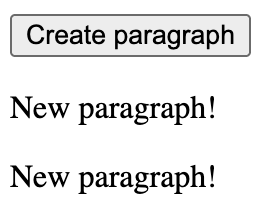
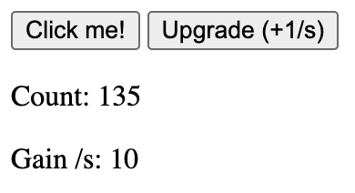

# Examples

## DOM

### Create paragraphs on click

This example creates new paragraphs in a `div` as you click on a `button`.



```html
<!DOCTYPE html>
<html lang="en">
<head>
  <meta charset="UTF-8">
  <meta name="viewport" content="width=device-width, initial-scale=1.0">
  <title>Create Elements Dynamically</title>
</head>
<body>
  <button id="create-btn">Create paragraph</button>
  <div id="paragraphs"></div>

  <script type="module">
    import * as facile from 'https://cdn.jsdelivr.net/npm/facilejs@latest/facile.es.js';

    facile.onClick('#create-btn', () => {
      const p = facile.addElement('p', '#paragraphs');
      facile.write(p, 'New paragraph!');
    });
  </script>
</body>
</html>
```

## Time

### Clicker game



```html
<!DOCTYPE html>
<html lang="en">
<head>
  <meta charset="UTF-8">
  <meta name="viewport" content="width=device-width, initial-scale=1.0">
  <title>Clicker Game</title>
</head>
<body>
  <div>
    <button id="clicker-btn">Click me!</button>
    <button id="upgrade-btn">Upgrade (+1/s)</button>
  </div>
  <div>
    <p>Count: <span id="count">0</span></p>
    <p>Gain /s: <span id="gain-per-second">0</span></p>
  </div>

  <script type="module">
    import * as facile from 'https://cdn.jsdelivr.net/npm/facilejs@latest/facile.es.js';

    // Declare variables: we use "state" so we can 
    let count = facile.state(0);
    let gainPerSecond = facile.state(0);

    // Whenever the count changes, display it in the page
    count.onChange((newCount) => {
      facile.write('#count', newCount);
    })
    // Same for the gain per second
    gainPerSecond.onChange((newCount) => {
      facile.write('#gain-per-second', newCount);
    })

    // Increase count by "gainPerSecond" every second
    facile.doEvery(1000, () => {
      count.value += gainPerSecond
    });

    // When the "Click me!" button is clicked, increase the count
    facile.onClick('#clicker-btn', () => {
      count.value += 1
    });

    // When the "Upgrade" button is clicked
    facile.onClick('#upgrade-btn', () => {
      gainPerSecond.value += 1;
    });
  </script>
</body>
</html>
```